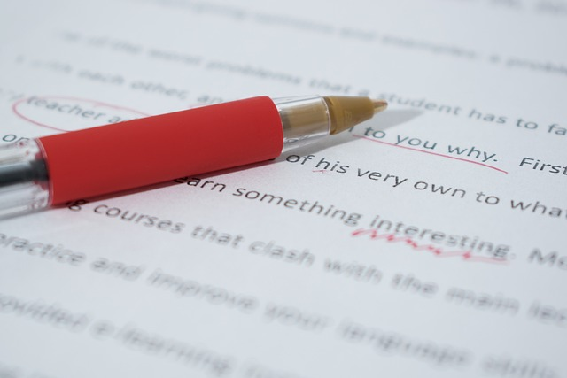

# Nominativ

El Nominativ és el cas del **subjecte** de l'oració, així com
de **l'atribut** dels verbs _sein, bleiben, werden_.

Els sustantius no tenen cap marca especial que identifique el
Nominativ, però sí en tenen els articles, determinants i adjectius.

Els adjectius tenen dos variants depenent de l'article o determinant
que tinguen davant, si és que en tenen algun.

{width=50%}

## Formes

### Article determinat

| Masculí | Femení | Neutre | Plural |
| ------- | ------ | ------ | ------ |
| der | die | das | die |

### Primer grup d'articles

En singular, el masculí i neutre no tenen cap marca, però el femení i
plural tenen la marca _-e_. Per exemple:

| Masculí | Femení | Neutre | Plural |
| ------- | ------ | ------ | ------ |
| kein | keine | kein | keine |

De la mateixa manera funcionen els articles _ein, mein, dein, sein,
ihr, unser, euer, Ihr_.

???+ warning "Atenció!"
    El femení i plural de _euer_ és **eure**, no _euere_.
    
### Segon grup d'articles

El masculí té la marca _-er_, el femení i el plural tenen la marca
_-e_ i el neutre té la marca _-es_. Per exemple:

| Masculí | Femení | Neutre | Plural |
| ------- | ------ | ------ | ------ |
| dieser | diese | dieses | diese |

De la mateixa manera funcionen els articles i pronoms _jen, jed, manch,
welch, jeglich, sämtlich_, entre altres.

### Els pronoms personals i l'interrogatiu "wer"

| Número | 1ª persona | 2ª persona informal | 2ª persona formal | 3ª persona masculí | 3ª persona femení | 3ª persona neutre |
| --- | --- | --- | --- | --- | --- | --- |
| Singular | ich | du | Sie | er | sie | es |
| Plural | wir | ihr | Sie | sie | sie | sie |

El pronom interrogatiu en Nominativ és _wer_.

### Els adjectius

Els adjectius agafen terminacions diferents segons quin determinant
tinguen davant:

* Si davant tenen un determinant del primer grup d'articles
o no tenen cap determinant, l'adjectiu
agafa la terminació que correspon al mateix gènere i número del
segon grup d'articles, és a dir, _-er_ per al masculí, _-e_ per al
femení, _-es_ per al neutre i _-e_ per al plural.

* Si davant tenen un determinant del segon grup d'articles, l'adjectiu
agafa la terminació _-e_ en singular i _-en_ en plural.

???+ warning "Atenció!"
    Els adjectius, quan funcionen com a atribut sense acompanyar
    un sustantiu, no agafen cap terminació.
    
## Exemples

Ací mostrem unes quantes oracions on resaltem el subjecte i/o
l'atribut. Fixa't com les formes i terminacions dels determinants i
adjectius es troben en les taules de dalt.

| Alemany | Valencià |
| --- | --- |
| **Der kleine Junge** spielt am Strand. | El nen xicotet juga en la platja. |
| **Ein kleiner Junge** spielt am Strand. | Un nen xicotet juga en la platja. |
| **Meine alte Freundin Antje** ist jetzt **verheiratet**. | La meua vella amiga Antje ara està casada. |
| **Das Klavier** ist **ein klassisches Musikinstrument**. | El piano és un instrument musical clàssic. |

## Més informació

<iframe width="560" height="315" src="https://www.youtube.com/embed/tF5ayvXfAD0?si=7GC5kh4Npd9xbe3X" title="YouTube video player" frameborder="0" allow="accelerometer; autoplay; clipboard-write; encrypted-media; gyroscope; picture-in-picture; web-share" referrerpolicy="strict-origin-when-cross-origin" allowfullscreen></iframe>
